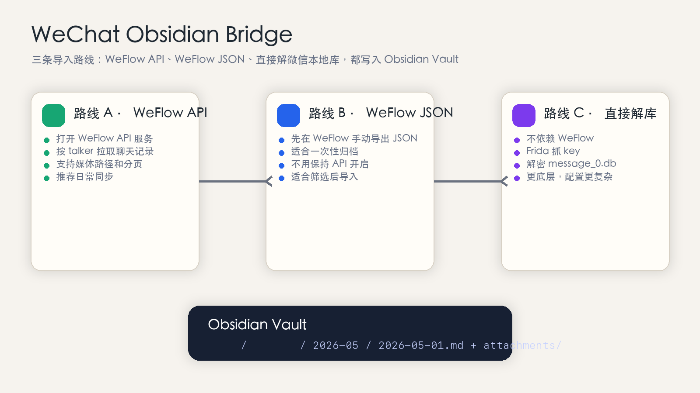
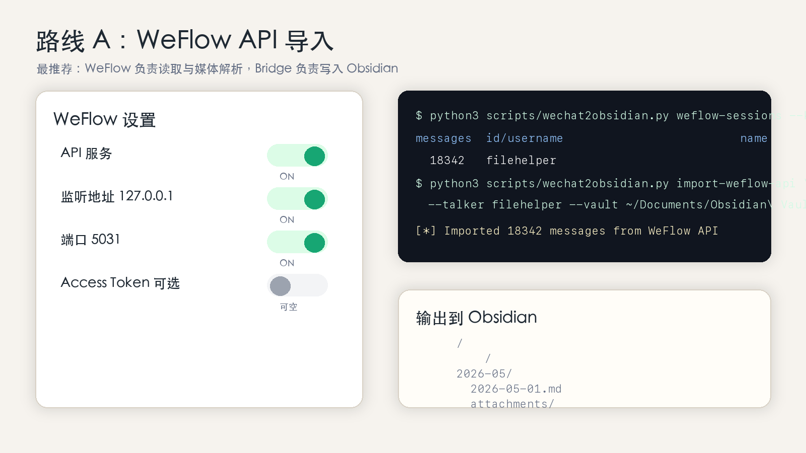
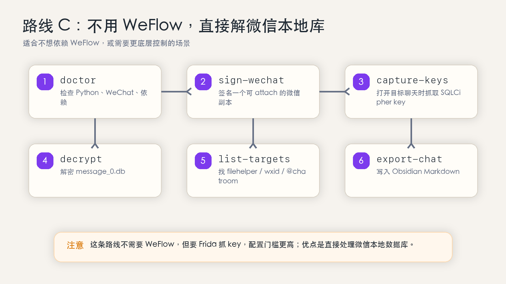
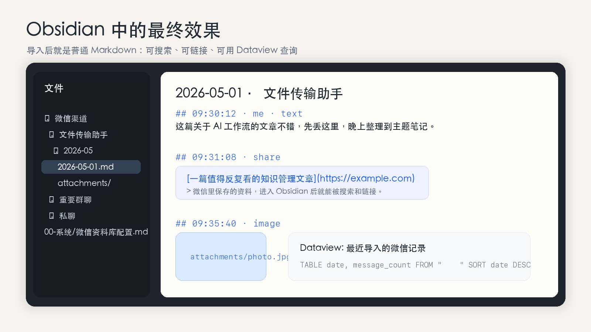
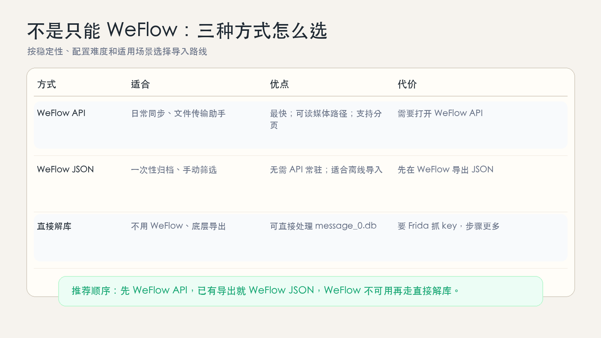

# WeChat Obsidian Bridge

> 微信 Obsidian 桥：把微信里的聊天记录、文件传输助手、链接、图片、语音、视频和学习资料导入到 Obsidian vault，变成可搜索、可链接、可长期沉淀的 Markdown 知识库。

这个仓库不是一个单纯的备份脚本，而是一个面向个人知识管理的导入桥：

- 优先用 `jackwener/wx-cli` 读取本地微信会话并导入 Obsidian。
- 如果 `wx-cli` 获取不到，可以用本地 `wechat-cli-pkg.tar.gz` 解压出来的 `wechat-cli` 二进制。
- 仍支持从 WeFlow 导出的 JSON 或 WeFlow 本地 HTTP API 导入 Obsidian。
- 在没有 WeFlow 的情况下，直接处理 macOS 微信 4.x 本地数据库，解密后导出指定聊天。
- 把聊天按日期拆成 Markdown，并把能拿到的媒体文件放到 `attachments/`。

## 截图预览

下面是示意截图，内容使用的是示例数据，不包含真实聊天隐私。











## 你想要的效果

### 1. 把 Obsidian 跟微信聊天记录打通

可以做到，但当前形态不是“安装一个 Obsidian 插件后自动同步微信”。

当前是这个链路：

```text
微信
  -> wx-cli / 本地 wechat-cli 包 / WeFlow
  -> wechat2obsidian.py
  -> Obsidian vault 里的 Markdown + attachments
  -> Obsidian 搜索、标签、反链、图谱、Dataview 等能力
```

也就是说，它是一个“导入桥”，把微信数据写进 Obsidian vault。写进去之后，Obsidian 会把这些聊天记录当作普通 Markdown 笔记处理。

### 2. 在 Obsidian 里看到聊天记录、文件、聊天资料和聊天数据

可以看到大部分本地能拿到的内容：

| 内容 | 当前支持情况 |
| --- | --- |
| 文本聊天 | 支持，按日期生成 Markdown |
| 文件传输助手 | 支持，推荐优先导入 |
| 群聊 / 私聊 | 支持，需要知道 `talker` / `wxid` / `@chatroom` |
| 链接 / 公众号文章卡片 | 支持渲染为 Markdown 链接，取决于源数据字段 |
| 图片 / 视频 / 语音 / 表情 | 支持复制或引用本地媒体，取决于 WeFlow 或微信本地是否已缓存 |
| 附件文件 | 支持复制到 `attachments/`，取决于源数据能否给出本地路径 |
| 聊天数据统计 | 当前会生成 manifest；更复杂的年报/统计建议先用 WeFlow，再把结果或数据导入 Obsidian |
| 微信收藏 | 通过 WeFlow 导出或聊天里的收藏/转发内容导入更稳；直接解析 `favorite.db` 仍属于后续增强 |

不能保证 100% 拿到的内容：

- 只存在云端、没有落到本地缓存的图片/视频/文件。
- 小程序、视频号、朋友圈等复杂云端内容。
- 微信本身没有保存完整原件的历史媒体。
- WeFlow/API 没有返回本地路径的媒体文件。

## 导入方式

不是只能使用 WeFlow。现在推荐优先用 `jackwener/wx-cli`，它直接从本机微信查询聊天记录，仓库再把结果写入 Obsidian。

| 方式 | 推荐度 | 适合场景 | 说明 |
| --- | --- | --- | --- |
| wx-cli | 首选 | 日常同步、文件传输助手、群聊/私聊 | `jackwener/wx-cli` 负责读取微信记录，本仓库负责导入 Obsidian |
| 本地 wechat-cli 包 | 备用 | `wx-cli` 装不上或获取不到时 | 使用你给的 `wechat-cli-pkg.tar.gz` 解压后的二进制 |
| WeFlow API / JSON | 兼容 | 已经在用 WeFlow 的场景 | 继续支持，但不再是第一推荐 |
| 直接解微信本地库 | 最后兜底 | 需要底层控制 | 需要 Frida 抓 key、解密 DB，步骤更多 |

推荐顺序：

```text
wx-cli -> 本地 wechat-cli 包 -> WeFlow API/JSON -> 直接解微信本地库
```

### 路线 A：wx-cli 导入，推荐

安装并初始化 `jackwener/wx-cli`：

```bash
npm install -g @jackwener/wx-cli
codesign --force --deep --sign - /Applications/WeChat.app
killall WeChat && open /Applications/WeChat.app
sudo wx init
```

确认能列出会话：

```bash
python3 scripts/wechat2obsidian.py wx-sessions --limit 100
```

导入文件传输助手：

```bash
python3 scripts/wechat2obsidian.py import-wx-cli \
  --chat filehelper \
  --vault ~/Documents/Obsidian\ Vault \
  --folder "微信渠道" \
  --subfolder "文件传输助手" \
  --since 2026-01-01 \
  --until 2026-05-01 \
  --media
```

导入某个群聊：

```bash
python3 scripts/wechat2obsidian.py import-wx-cli \
  --chat "群名称或 chatroom id" \
  --vault ~/Documents/Obsidian\ Vault \
  --folder "微信渠道" \
  --subfolder "重要群聊/群名" \
  --since 2026-04-01 \
  --until 2026-05-01
```

### 路线 B：本地 wechat-cli 包导入，备用

如果 `wx-cli` 获取不到，就用你本地的包：

```bash
tar -xzf /Users/siuserxiaowei/Library/Containers/com.tencent.xinWeChat/Data/Documents/xwechat_files/wxid_276exkqyuyd422_20a2/msg/file/2026-04/wechat-cli-pkg.tar.gz -C /tmp/wechat-cli-pkg
```

导入：

```bash
python3 scripts/wechat2obsidian.py import-wx-cli \
  --binary /tmp/wechat-cli-pkg/wechat-cli-pkg/wechat-cli/node_modules/@canghe_ai/wechat-cli-darwin-arm64/bin/wechat-cli \
  --chat "群名称或文件传输助手" \
  --vault ~/Documents/Obsidian\ Vault \
  --folder "微信渠道" \
  --subfolder "wx-cli导入" \
  --since 2026-04-01 \
  --until 2026-05-01
```

### 路线 C：WeFlow 本地 API 导入，兼容

1. 打开 WeFlow。
2. 进入设置，开启 `API 服务`。
3. 如果设置了 Access Token，复制 token；如果 token 是空的，可以不传。
4. 在终端进入本仓库：

```bash
cd /Users/siuserxiaowei/Desktop/dont哥\ 对谈/wechat-to-obsidian
```

5. 看看 WeFlow API 是否能列出会话：

```bash
python3 scripts/wechat2obsidian.py weflow-sessions --keyword 文件
```

如果你想列出更多会话：

```bash
python3 scripts/wechat2obsidian.py weflow-sessions --limit 200
```

6. 导入文件传输助手到 Obsidian：

```bash
python3 scripts/wechat2obsidian.py import-weflow-api \
  --talker filehelper \
  --vault ~/Documents/Obsidian\ Vault \
  --folder "微信渠道" \
  --subfolder "文件传输助手" \
  --media
```

如果 WeFlow 配了 token：

```bash
python3 scripts/wechat2obsidian.py import-weflow-api \
  --talker filehelper \
  --vault ~/Documents/Obsidian\ Vault \
  --folder "微信渠道" \
  --subfolder "文件传输助手" \
  --token "你的 WeFlow Token" \
  --media
```

限制日期范围：

```bash
python3 scripts/wechat2obsidian.py import-weflow-api \
  --talker filehelper \
  --vault ~/Documents/Obsidian\ Vault \
  --folder "微信渠道" \
  --subfolder "文件传输助手" \
  --since 2026-01-01 \
  --until 2026-05-01 \
  --media
```

导入后 Obsidian 里会出现类似结构：

```text
Obsidian Vault/
└── 微信渠道/
    └── 文件传输助手/
        ├── 2026-01/
        │   ├── 2026-01-03.md
        │   └── attachments/
        ├── 2026-02/
        │   ├── 2026-02-18.md
        │   └── attachments/
        └── _weflow_import_manifest.json
```

### 路线 D：导入 WeFlow 导出的 JSON

如果你已经在 WeFlow 里导出了 JSON 文件：

```bash
python3 scripts/wechat2obsidian.py import-weflow-json \
  --input ~/Downloads/weflow-export.json \
  --vault ~/Documents/Obsidian\ Vault \
  --folder "微信渠道" \
  --subfolder "某个会话"
```

这条路线适合一次性导入，也适合你先在 WeFlow 里筛选/导出，再进 Obsidian。

### 路线 E：不用 wx-cli/WeFlow，直接解微信本地库

这条路线更底层，适合 WeFlow 不可用或你想直接处理 macOS 微信 4.x 本地数据库。

安装依赖：

```bash
python3 -m pip install -r requirements.txt
```

检查环境：

```bash
python3 scripts/wechat2obsidian.py doctor
```

签名一个可被 Frida attach 的微信副本：

```bash
python3 scripts/wechat2obsidian.py sign-wechat \
  --dest ~/Desktop/WeChat-Obsidian.app
```

抓取数据库 key：

```bash
python3 scripts/wechat2obsidian.py capture-keys \
  --wechat-app ~/Desktop/WeChat-Obsidian.app \
  --launch \
  --wait 300
```

抓 key 时，在微信里打开你要导出的聊天，比如 `文件传输助手`。

解密 `message_0.db`：

```bash
USER_DIR=$(python3 scripts/wechat2obsidian.py locate-user --print-path)

python3 scripts/wechat2obsidian.py decrypt \
  --db "$USER_DIR/db_storage/message/message_0.db" \
  --out /tmp/message_0.decrypted.db
```

列出可导出的会话：

```bash
python3 scripts/wechat2obsidian.py list-targets \
  --db /tmp/message_0.decrypted.db \
  --limit 50
```

导出文件传输助手：

```bash
python3 scripts/wechat2obsidian.py export-chat \
  --db /tmp/message_0.decrypted.db \
  --target filehelper \
  --vault ~/Documents/Obsidian\ Vault \
  --folder "微信渠道" \
  --subfolder "文件传输助手" \
  --with-senders
```

## Obsidian 里怎么看

导入完成后，打开你的 Obsidian vault：

1. 左侧文件树会看到 `微信渠道/文件传输助手/2026-xx/2026-xx-xx.md`。
2. 每天一个 Markdown 文件。
3. 每条消息是一个时间戳小标题。
4. 图片、视频、语音、文件会尽量放在同月份的 `attachments/`。
5. 链接类消息会尽量渲染成 Markdown 链接。
6. 你可以用 Obsidian 全文搜索、标签、反链、图谱、Dataview 等插件继续整理。

## Obsidian 配置文档

已经准备了一份可以直接放进 Obsidian 的配置手册：

```text
docs/Obsidian-微信资料库配置.md
```

里面包含推荐目录、WeFlow 设置、导入命令、Dataview 查询、搜索语法、日常同步流程和排错清单。

## 当前不是 Obsidian 插件

这点很重要：

- 不能直接在 Obsidian 社区插件里搜索安装。
- 不是安装 Obsidian 后自动同步微信。
- 当前需要你运行一次 CLI 命令，把数据导入 vault。
- 后续可以在这个仓库上继续做一个真正的 Obsidian 插件，把按钮、同步任务、配置界面都放进 Obsidian。

## 常用命令速查

```bash
# 检查环境
python3 scripts/wechat2obsidian.py doctor

# 列 wx-cli 会话
python3 scripts/wechat2obsidian.py wx-sessions --limit 100

# 从 wx-cli 导入文件传输助手
python3 scripts/wechat2obsidian.py import-wx-cli \
  --chat filehelper \
  --vault ~/Documents/Obsidian\ Vault \
  --folder "微信渠道" \
  --subfolder "文件传输助手" \
  --media

# 从 WeFlow JSON 导入
python3 scripts/wechat2obsidian.py import-weflow-json \
  --input ~/Downloads/weflow-export.json \
  --vault ~/Documents/Obsidian\ Vault \
  --folder "微信渠道"
```

## 安全说明

- 只处理你自己的微信数据。
- 不要把 key log、解密后的数据库、聊天附件上传到公开仓库。
- `.gitignore` 已经默认排除数据库、key log、导出目录等敏感文件。
- 优先使用 `jackwener/wx-cli`，避免自己维护 Frida 抓 key 和数据库解密链路。

## 参考项目

这个项目参考和吸收了这些公开项目的思路：

- `Jane-xiaoer/wechat-to-obsidian`
- `jackwener/wx-cli`
- `zhuyansen/wx-favorites-report`
- `hicccc77/WeFlow`
- `ILoveBingLu/CipherTalk`

详细说明见 `NOTICE` 和 `references/upstream-projects.md`。
